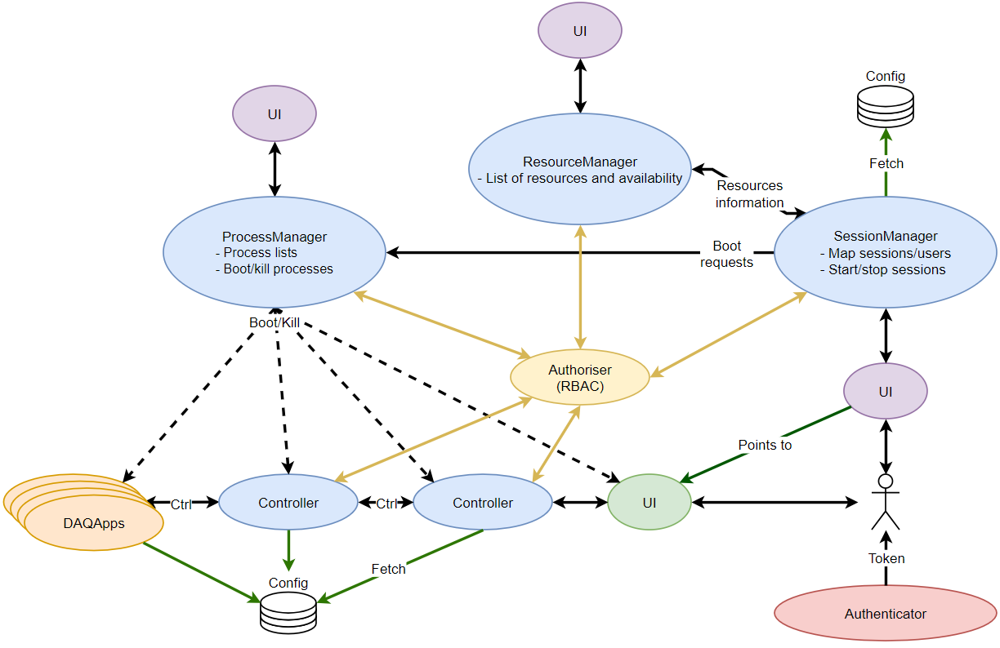

# DUNE Run Control (drunc)

Users - see the [documentation](https://dune-daq.github.io/drunc/)

This software defines a flexible run control infrastructure for a distributed DAQ system defined in a set of configuration files used at run time for DUNE. Operation of the experiment is defined through a finite state machine (FSM) which describes the operational state of the DAQ.

The project is still under development, and as such will still have bugs or features that users may not want. If you encounter any of these please raise an issue and describe it clearly so that we can resolve it easily.

# Setting up
If you are trying to run `drunc` you **must** have a DUNE-DAQ environment, with `cvmfs` available. See setup instructions [here](https://dune-daq-sw.readthedocs.io/en/latest/packages/daq-buildtools/) to setup an nightly or a static release.

# Running drunc
Once you have drunc, you can look at the [quick start instructions](https://dune-daq-sw.readthedocs.io/en/latest/packages/drunc/Running-drunc).

If you need more details:
* [Process manager](https://dune-daq-sw.readthedocs.io/en/latest/packages/drunc/Process-manager)
* [Controller](https://dune-daq-sw.readthedocs.io/en/latest/packages/drunc/Controller)
* [Unified shell](https://dune-daq-sw.readthedocs.io/en/latest/packages/drunc/Unified-shell-reference) (merges the controller and process manager shells)

There are more in depth descriptions of part of the system here:
* [FSM](https://dune-daq-sw.readthedocs.io/en/latest/packages/drunc/FSM)

Finally, we have a [FAQ](https://dune-daq-sw.readthedocs.io/en/latest/packages/drunc/FAQ), have a look there if you have a problem!

# Developing
If are developing a user interface for `drunc`, you can get help here:
* [Messaging format](https://dune-daq-sw.readthedocs.io/en/latest/packages/drunc/Messaging-format) (valid for all the `drunc` endpoints)
* [Process manager endpoint description](https://dune-daq-sw.readthedocs.io/en/latest/packages/drunc/Process-manager-interface)
* [Controller endpoint description](https://dune-daq-sw.readthedocs.io/en/latest/packages/drunc/Controller-interface)
* [Graph](graph/) (interactive UML class/package diagrams)

There is more developer information in the [drunc wiki](https://github.com/DUNE-DAQ/drunc/wiki).

## Pull request reviewer routing

Reviewer pools are configured in `.github/mapping/reviewer-map.yml` and use the exact labels from `.github/mapping/label-map.yml`. Each matching label selects one weighted reviewer. Weights are selection probabilities for a uniform random draw seeded with the PR number and label, so reruns for the same PR are reproducible and labels are drawn independently; they are not a workload guarantee. The selector is isolated behind `ReviewerSelector`; its context includes the PR, label, exclusions, and a read-only GitHub client for a future history-based selector. Changing the strategy requires replacing the selector construction in `.github/scripts/assign_reviewers.py`.

Draft pull requests show a proposed route in the Actions summary only. Review requests and the notification comment are considered only when a draft is marked ready for review. Reviewers are never removed by this workflow, and existing requests or submitted reviews are preserved on reruns. Labels are added by the existing labeler and are not automatically removed.

When a pull request is ready for review, the routing bot comment includes the required reviewer checklist. Its stable item IDs are `implementation` and `tests-docs`; the checklist comment is the source of truth for the `reviewer-checklist` commit status. Checked states are preserved when routing updates the comment, and newly introduced items start unchecked. The comment is created even when no reviewers are selected.

The `reviewer-checklist` workflow validates the current comment after the `PR review` workflow completes, whenever a PR conversation comment is created, edited, or deleted, and on manual dispatch with a PR number. It fetches current PR/comment data from GitHub and publishes the status against the current PR head SHA. Missing, duplicated, malformed, or incomplete routing checklists fail the status. Draft and closed pull requests publish a successful skipped status. Configure `reviewer-checklist` as a required status check in branch protection or a ruleset to enforce completion.

Both workflows use trusted repository scripts and configuration from the default branch; neither checks out or executes pull request head code. Changes to routing configuration and workflow code take effect after they are merged into the default branch.

# Release notes
... are [here](https://dune-daq-sw.readthedocs.io/en/latest/packages/drunc/Release-notes)
