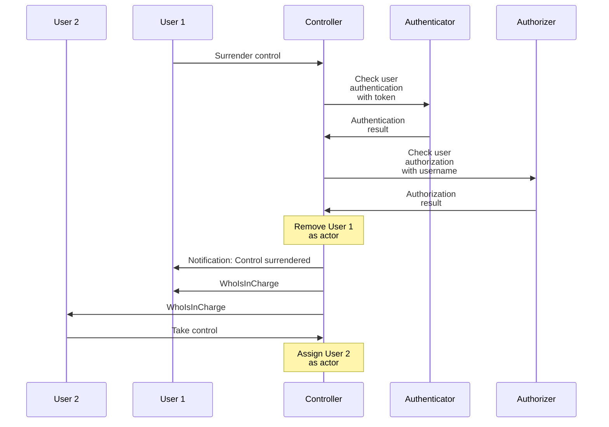

```mermaid
---
id: d0abd951-f88e-487f-a1a3-1c11060408d8
---
sequenceDiagram
    participant U2 as User 2
    participant U1 as User 1
    participant C as Controller
    participant A1 as Authenticator
    participant A2 as Authorizer

    U1 ->> C: Surrender control
    C ->> A1: Check user <br> authentication <br> with token
    A1 ->> C: Authentication <br> result
    C ->> A2: Check user <br> authorization <br> with username
    A2 ->> C: Authorization <br> result
    Note over C: Remove User 1 <br> as actor
    C ->> U1: Notification: Control surrendered
    C ->> U1: WhoIsInCharge
    C ->> U2: WhoIsInCharge
    U2 ->> C: Take control
    Note over C: Assign User 2 <br> as actor
```