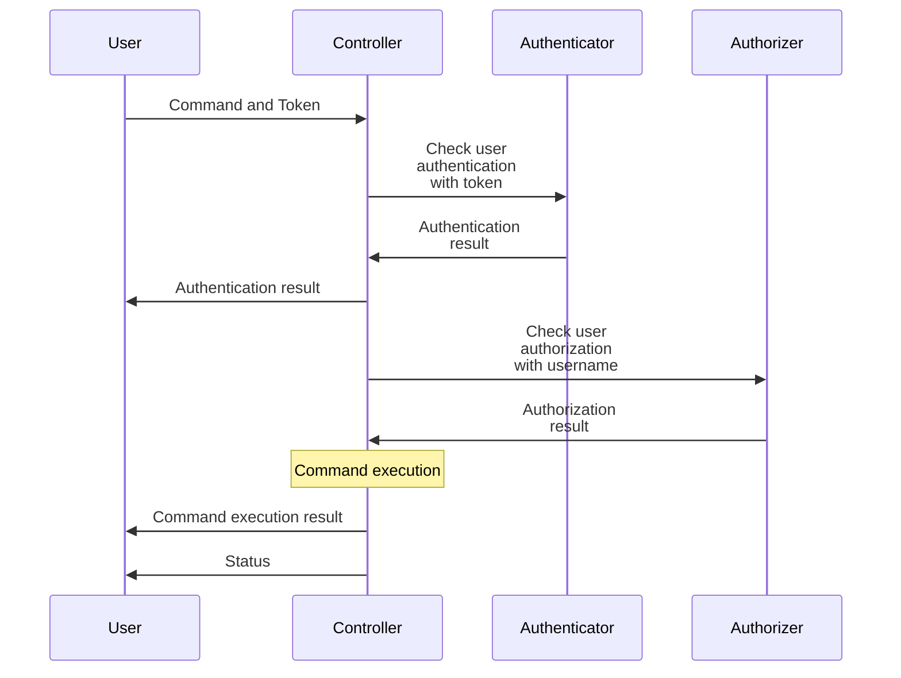
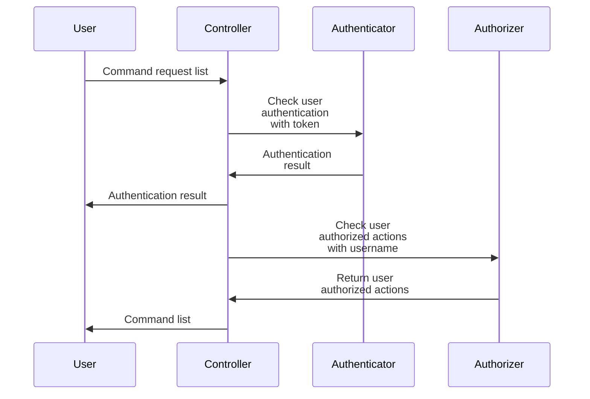

# General command excecution

```mermaid
sequenceDiagram
    participant User
    participant C as Controller
    participant A1 as Authenticator
    participant A2 as Authorizer

    User ->> C: Command and Token
    C ->> A1: Check user <br> authentication <br> with token
    A1 ->> C: Authentication <br> result
    C ->> User: Authentication result
    C ->> A2: Check user <br> authorization <br> with username
    A2 ->> C: Authorization <br> result
    Note over C: Command execution
    C ->> User: Command execution result
    C ->> User: Status

```

# List available commands

```mermaid
sequenceDiagram
    participant User
    participant C as Controller
    participant A1 as Authenticator
    participant A2 as Authorizer

    User ->> C: Command request list
    C ->> A1: Check user <br> authentication <br> with token
    A1 ->> C: Authentication <br> result
    C ->> User: Authentication result
    C ->> A2: Check user <br> authorized actions <br> with username
    A2 ->> C: Return user <br> authorized actions
    C ->> User: Command list

```