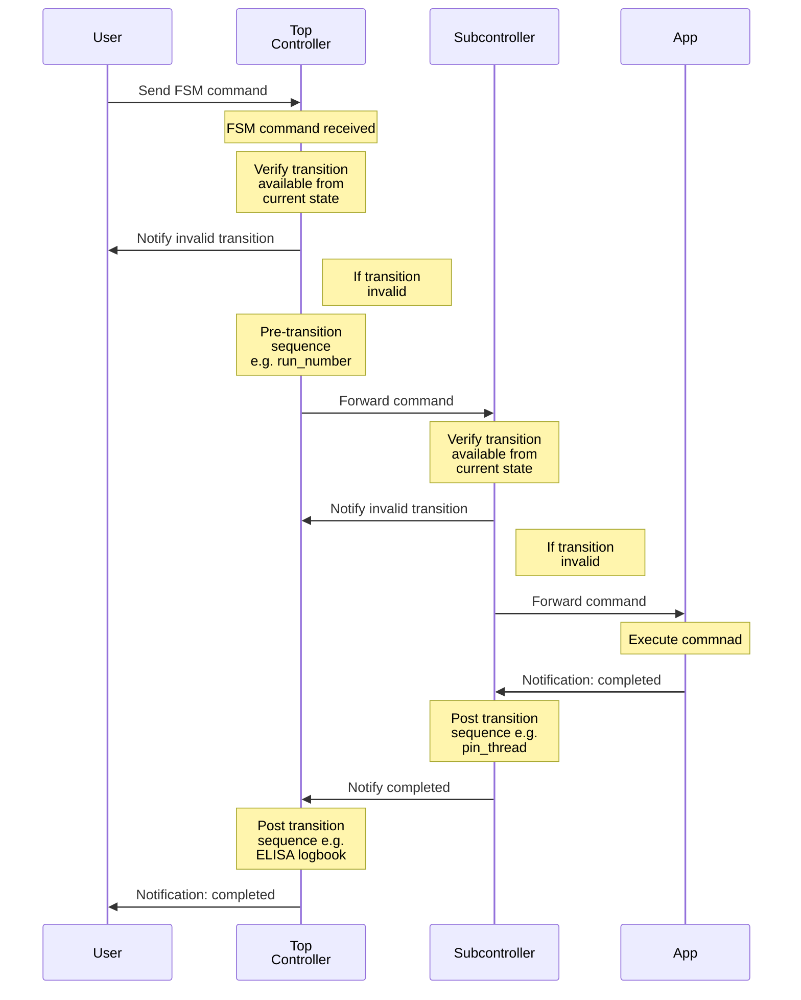

```mermaid
sequenceDiagram
    participant User
    participant TC as Top <br> Controller
    participant SC as Subcontroller
    participant A as App

    User ->> TC: Send FSM command
    Note over TC: FSM command received
    Note over TC: Verify transition <br> available from <br> current state
    TC ->> User: Notify invalid transition
    Note right of TC: If transition <br> invalid

    Note over TC: Pre-transition <br> sequence <br> e.g. run_number
    TC ->> SC: Forward command

    Note over SC: Verify transition <br> available from <br> current state
    SC ->> TC: Notify invalid transition
    Note right of SC: If transition <br> invalid
    
    SC ->> A: Forward command
    Note over A: Execute commnad
    A ->> SC: Notification: completed

    Note over SC: Post transition <br> sequence e.g. <br> pin_thread
    SC ->> TC: Notify completed

    Note over TC: Post transition <br> sequence e.g. <br> ELISA logbook
    TC ->> User: Notification: completed
```