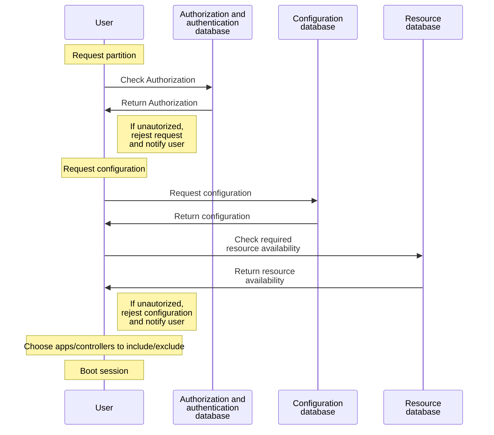

```mermaid
sequenceDiagram
    participant User
    participant AuthDB as Authorization and <br> authentication <br> database
    participant ConfDB as Configuration <br> database
    participant ResDB as Resource <br> database

    Note over User: Request partition
    User ->> AuthDB: Check Authorization
    AuthDB ->> User: Return Authorization
    Note right of User: If unautorized, <br> rejest request <br> and notify user

    Note over User: Request configuration
    User ->> ConfDB: Request configuration
    ConfDB ->> User: Return configuration
    User ->> ResDB: Check required <br> resource availability
    ResDB ->> User: Return resource <br> availability
    Note right of User: If unautorized, <br> rejest configuration <br> and notify user

    Note over User: Choose apps/controllers to include/exclude

    Note over User: Boot session
```