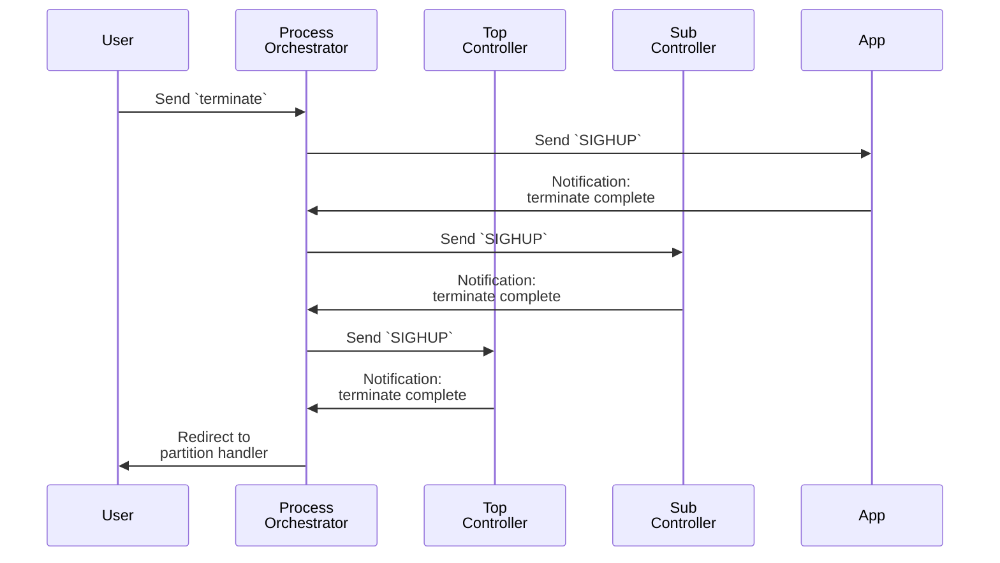

```mermaid
sequenceDiagram
    participant User
    participant PO as Process <br> Orchestrator
    participant TC as Top <br> Controller
    participant SC as Sub <br> Controller
    participant A as App

    User ->> PO: Send `terminate`
    PO ->> A: Send `SIGHUP`
    A ->> PO: Notification: <br> terminate complete
    PO ->> SC: Send `SIGHUP`
    SC ->> PO: Notification: <br> terminate complete
    PO ->> TC: Send `SIGHUP`
    TC ->> PO: Notification: <br> terminate complete
    PO ->> User: Redirect to <br> partition handler
```