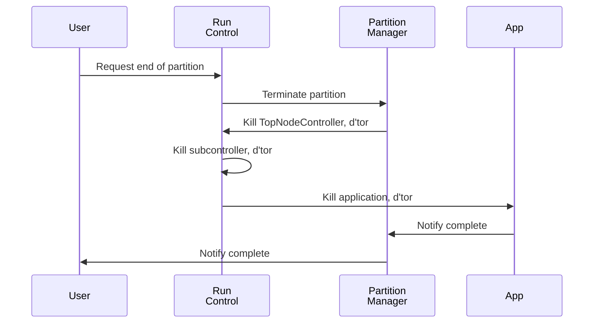

```mermaid
sequenceDiagram
    participant User
    participant RC as Run <br> Control
    participant PartM as Partition <br> Manager
    participant App

    User ->> RC: Request end of partition
    RC ->> PartM: Terminate partition
    PartM ->> RC: Kill TopNodeController, d'tor
    RC ->> RC: Kill subcontroller, d'tor
    RC ->> App: Kill application, d'tor
    App ->> PartM: Notify complete
    PartM ->> User: Notify complete
```