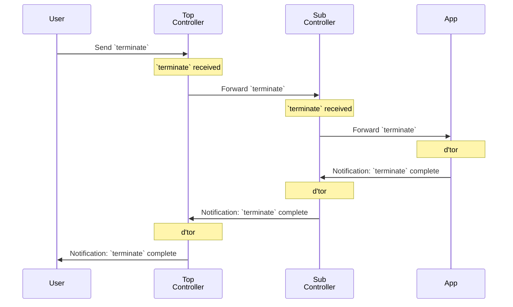

```mermaid
sequenceDiagram
    participant User
    participant TC as Top <br> Controller
    participant SC as Sub <br> Controller
    participant A as App

    User ->> TC: Send `terminate`
    Note over TC: `terminate` received
    TC ->> SC: Forward `terminate`
    Note over SC: `terminate` received
    SC ->> A: Forward `terminate`
    Note over A: d'tor
    A ->> SC: Notification: `terminate` complete
    Note over SC: d'tor
    SC ->> TC: Notification: `terminate` complete
    Note over TC: d'tor
    TC ->> User: Notification: `terminate` complete
```