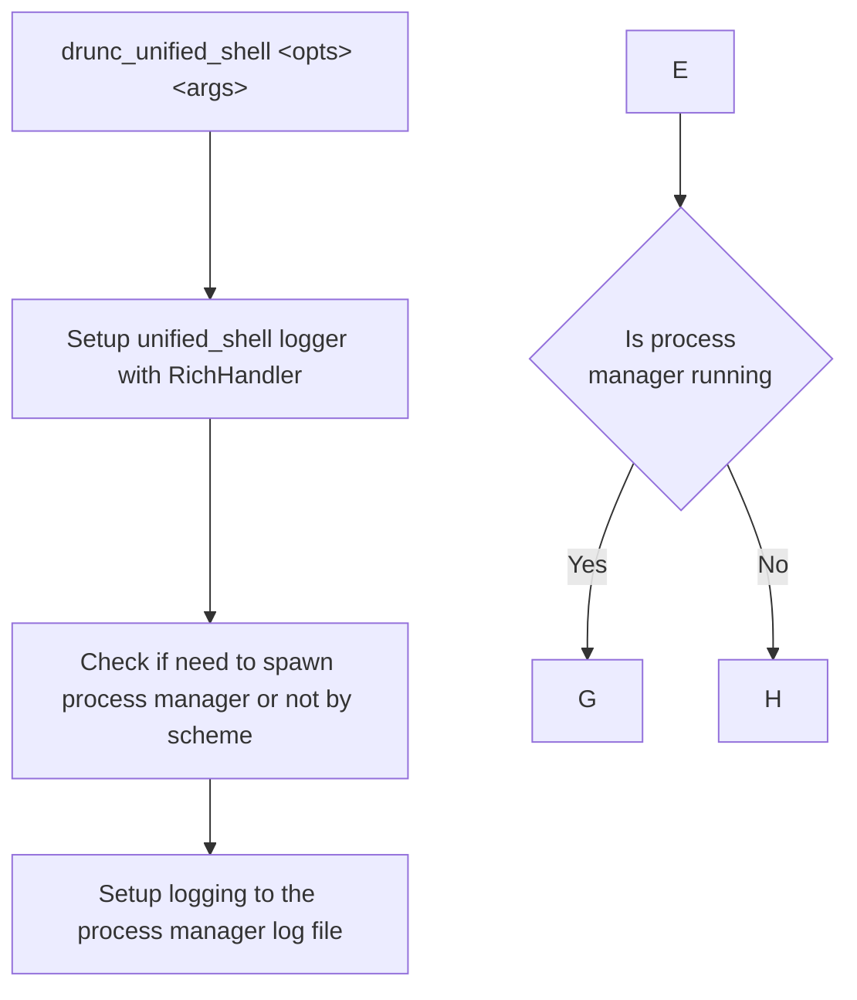

# Module: `unified_shell`

::: mymodule
    handler: python

## unified_shell()

```mermaid
flowchart TD
    A[drunc_unified_shell &ltopts&gt &ltargs&gt] --> B[Setup unified_shell logger with RichHandler]
    B --> C[Check if need to spawn process manager or not by scheme]
    C --> D[Setup logging to the process manager log file]
    E --> F{Is process <br> manager running}
    F -- Yes --> G
    F -- No --> H
```